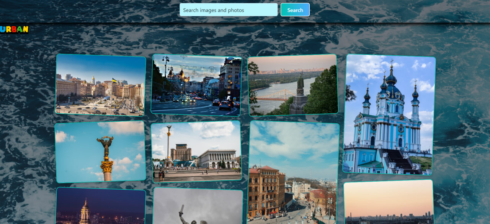

Hi My name is Illia Urban
===================================================================================================================================

Hi! I’m a passionate front-end developer with a love for creating user-friendly web applications. I specialize in React, JavaScript, and modern tools like Vite, Redux, and CSS modules, blending clean code with creative design. With hands-on experience in building responsive interfaces and integrating APIs, I enjoy solving complex problems and optimizing performance. Beyond coding, I’m keen on exploring new technologies, experimenting with animations, and sharing knowledge through open-source projects. This GitHub profile reflects my journey—feel free to explore my work, connect with me, or collaborate!

*   🌍  I'm based in Kiev
*   ✉️  You can contact me at [urban.mutagen@gmail.com](mailto:urban.mutagen@gmail.com )     And [Telegram](https://t.me/urbanIllia)
*   🧠  I'm learning React.js Node.js
*   
*   Skills
*   

                    
                    

## My Projects

### Merge DreamLand
Developed using HTML, CSS, and SCSS, no React involved. Commercial individual Project.

- Description: This website is dedicated to the game Merge DreamLand.
- [Link](https://glowwinnerstar.com/), [Repository](https://urbanillia.github.io/project2/)
 
.........................................................................
### My React Practice
React Practice on Various Topics. Individual

- Description: API, Routing, React/Redux, useHooks, Formik, Axios, Tailwind....
- [Link](https://react-dz-1.vercel.app/), [Repository](https://github.com/UrbanIllia/react-practice)

.........................................................................
- ### Rental Car
Car selection website. Individual Project

- Description:  React/Redux, API, Formik, React Router, Figma 
- [Link](https://rental-car-alpha-ten.vercel.app), [Repository](https://github.com/UrbanIllia/RentalCar)
 
 .........................................................................
 - ### Expense Tracker
Application for monitoring financial expenses. Team Project

- Description: React/Redux, axios, formik, React Router, react-datepicker, react-hot-toast, react-spinners, Figma 
- [Link](https://dev-nest-lovat.vercel.app/), [Repository](https://github.com/llDeRuNll/DevNest)

- More Team Projects

  
  

- My Practice React more
 

  
  
  
  
  
  

 
 

<!---
UrbanIllia/UrbanIllia is a ✨ special ✨ repository because its `README.md` (this file) appears on your GitHub profile.
You can click the Preview link to take a look at your changes.
--->
